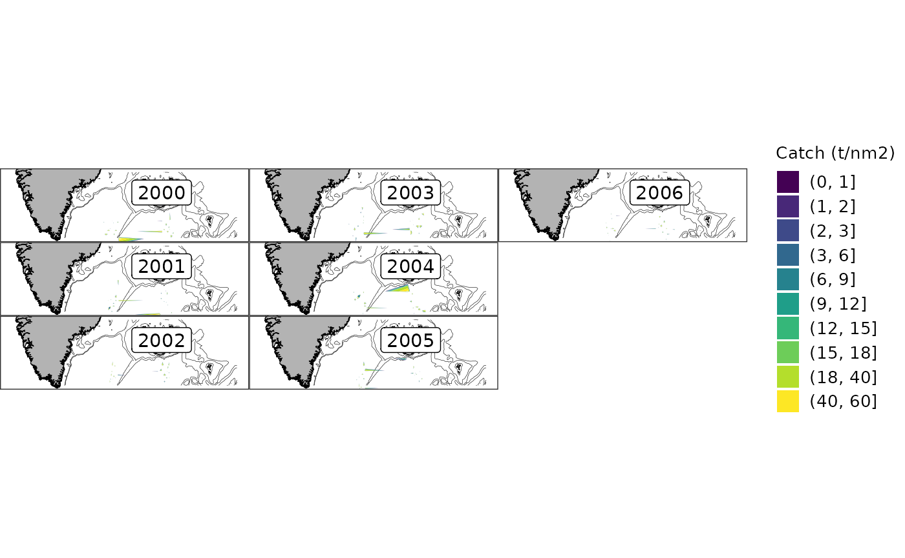

# Incorporating external data

First, invent some data to use later:

``` r

logbook_fo <- expand.grid(month = 1:12, year = 2000:2006)
logbook_fo$vessel_nr <- sample(1:100, nrow(logbook_fo), replace = TRUE)
logbook_fo$mfdb_gear_code <- "LLN"
logbook_fo$lat <- round(rnorm(nrow(logbook_fo), 61.0), 3)
logbook_fo$lon <- round(rnorm(nrow(logbook_fo), -17.5), 3)
logbook_fo$catch <- runif(nrow(logbook_fo), 1e4, 1e6)
logbook_fo$tow_area <- rnorm(nrow(logbook_fo), 12, 0.6)
logbook_fo$tow_time <- rnorm(nrow(logbook_fo), 300, 10)

logbook_gl <- expand.grid(month = 1:12, year = 2000:2006)
logbook_gl$vessel_nr <- sample(1:100, nrow(logbook_gl), replace = TRUE)
logbook_gl$mfdb_gear_code <- "LLN"
logbook_gl$lat <- round(rnorm(nrow(logbook_gl), 61.0), 3)
logbook_gl$lon <- round(rnorm(nrow(logbook_gl), -30.5), 3)
logbook_gl$catch <- runif(nrow(logbook_gl), 1e4, 1e6)
logbook_gl$tow_area <- rnorm(nrow(logbook_gl), 12, 0.6)
logbook_gl$tow_time <- rnorm(nrow(logbook_gl), 300, 10)
```

Data can be imported into a Pax DB using
[`pax_import()`](https://hafro.github.io/pax/reference/pax_import.md):

``` r

library(pax)
# NB: pax_landings_fishingyear_summary() (pax_add_fishing_year()) calls sql()
#     without dplyr::, so it fails unless dplyr is attached
library(dplyr, warn.conflicts = FALSE)

# NB: In real-life this will probably be generated using pax::pax_from_mar()
pcon <- pax::pax_connect()
```

    ## duckdb keeps downloaded extensions and secrets in a temporary directory:
    ## ℹ /tmp/RtmpILWg62/duckdb
    ## This is removed when the R session ends.
    ## • Extensions are re-downloaded each session.
    ## • Secrets are lost.
    ## ℹ Run duckdb(shared_home = TRUE) (or create ~/.duckdb) to keep them (suitable for most users).
    ## ℹ Run duckdb(shared_home = FALSE) to accept the temporary directory (and silence this message).
    ## ℹ See ?duckdb_storage for details and alternatives.

``` r

pax_import(pcon, pax_marmap_ocean_depth())
```

    ## duckdb keeps downloaded extensions and secrets in a temporary directory:
    ## ℹ /tmp/RtmpILWg62/duckdb
    ## This is removed when the R session ends.
    ## • Extensions are re-downloaded each session.
    ## • Secrets are lost.
    ## ℹ Run duckdb(shared_home = TRUE) (or create ~/.duckdb) to keep them (suitable for most users).
    ## ℹ Run duckdb(shared_home = FALSE) to accept the temporary directory (and silence this message).
    ## ℹ See ?duckdb_storage for details and alternatives.

``` r

for (s in pax_def_strata_list()) {
  pax_import(pcon, pax_def_strata(s))
}
```

    ## Reading layer `strata_ghl_strata' from data source 
    ##   `/home/runner/work/_temp/Library/pax/extdata/strata_ghl_strata.shp' 
    ##   using driver `ESRI Shapefile'
    ## Simple feature collection with 28 features and 4 fields
    ## Geometry type: MULTIPOLYGON
    ## Dimension:     XY
    ## Bounding box:  xmin: -41.17083 ymin: 61.78417 xmax: -8.2475 ymax: 68.2
    ## Geodetic CRS:  WGS 84
    ## Reading layer `strata_new_strata_autumn' from data source 
    ##   `/home/runner/work/_temp/Library/pax/extdata/strata_new_strata_autumn.shp' 
    ##   using driver `ESRI Shapefile'

    ## Warning in CPL_read_ogr(dsn, layer, query, as.character(options), quiet, : GDAL
    ## Message 1:
    ## /home/runner/work/_temp/Library/pax/extdata/strata_new_strata_autumn.shp
    ## contains polygon(s) with rings with invalid winding order. Autocorrecting them,
    ## but that shapefile should be corrected using ogr2ogr for example.

    ## Simple feature collection with 32 features and 4 fields
    ## Geometry type: MULTIPOLYGON
    ## Dimension:     XY
    ## Bounding box:  xmin: -29.55791 ymin: 62.113 xmax: -9.328556 ymax: 68.24116
    ## Geodetic CRS:  WGS 84
    ## Reading layer `strata_new_strata_spring' from data source 
    ##   `/home/runner/work/_temp/Library/pax/extdata/strata_new_strata_spring.shp' 
    ##   using driver `ESRI Shapefile'

    ## Warning in CPL_read_ogr(dsn, layer, query, as.character(options), quiet, : GDAL
    ## Message 1:
    ## /home/runner/work/_temp/Library/pax/extdata/strata_new_strata_spring.shp
    ## contains polygon(s) with rings with invalid winding order. Autocorrecting them,
    ## but that shapefile should be corrected using ogr2ogr for example.

    ## Simple feature collection with 32 features and 4 fields
    ## Geometry type: MULTIPOLYGON
    ## Dimension:     XY
    ## Bounding box:  xmin: -29.55791 ymin: 62.113 xmax: -9.328556 ymax: 68.24116
    ## Geodetic CRS:  WGS 84
    ## Reading layer `strata_old_strata' from data source 
    ##   `/home/runner/work/_temp/Library/pax/extdata/strata_old_strata.shp' 
    ##   using driver `ESRI Shapefile'

    ## Warning in CPL_read_ogr(dsn, layer, query, as.character(options), quiet, : GDAL
    ## Message 1: /home/runner/work/_temp/Library/pax/extdata/strata_old_strata.shp
    ## contains polygon(s) with rings with invalid winding order. Autocorrecting them,
    ## but that shapefile should be corrected using ogr2ogr for example.

    ## Simple feature collection with 74 features and 4 fields
    ## Geometry type: MULTIPOLYGON
    ## Dimension:     XY
    ## Bounding box:  xmin: -30.02 ymin: 59.602 xmax: -8.689 ymax: 68.72
    ## Geodetic CRS:  WGS 84
    ## Reading layer `strata_smn_strata' from data source 
    ##   `/home/runner/work/_temp/Library/pax/extdata/strata_smn_strata.shp' 
    ##   using driver `ESRI Shapefile'
    ## Simple feature collection with 9 features and 4 fields
    ## Geometry type: POLYGON
    ## Dimension:     XY
    ## Bounding box:  xmin: -24.4291 ymin: 63.1778 xmax: -14.13804 ymax: 66.70596
    ## Geodetic CRS:  WGS 84

``` r

pax_import(pcon, logbook_fo, cite = "logbook_fo.csv")
pax_import(pcon, logbook_gl, cite = "logbook_gl.csv")
```

We can list the contents:

``` r

pax_contents(pcon)
```

    ## # A query:  ?? x 2
    ## # Database: DuckDB 1.5.6 [unknown@Linux 6.17.0-1022-azure:R 4.6.1/:memory:]
    ##   tbl_name          citation                
    ##   <chr>             <chr>                   
    ## 1 ocean_depth       pax_marmap_ocean_depth()
    ## 2 ghl_strata        pax_def_strata(s)       
    ## 3 new_strata_autumn pax_def_strata(s)       
    ## 4 new_strata_spring pax_def_strata(s)       
    ## 5 old_strata        pax_def_strata(s)       
    ## 6 smn_strata        pax_def_strata(s)       
    ## 7 logbook_fo        logbook_fo.csv          
    ## 8 logbook_gl        logbook_gl.csv

By default
[`pax_import()`](https://hafro.github.io/pax/reference/pax_import.md)
will use the incoming name as the table name. This can be overridden
with the `name` parameter.

We can use the imported tables as we would the mar “logbook” table:

``` r

dplyr::tbl(pcon, "logbook_gl") |>
   pax_landings_fishingyear_summary()
```

    ## # A query:    ?? x 2
    ## # Database:   DuckDB 1.5.6 [unknown@Linux 6.17.0-1022-azure:R 4.6.1/:memory:]
    ## # Ordered by: fishing_year
    ##   fishing_year catch_t
    ##   <chr>          <dbl>
    ## 1 1999/2000       3731
    ## 2 2000/2001       6241
    ## 3 2001/2002       6233
    ## 4 2002/2003       5277
    ## 5 2003/2004       5193
    ## 6 2004/2005       6106

``` r

dplyr::tbl(pcon, "logbook_fo") |>
   pax_landings_fishingyear_summary()
```

    ## # A query:    ?? x 2
    ## # Database:   DuckDB 1.5.6 [unknown@Linux 6.17.0-1022-azure:R 4.6.1/:memory:]
    ## # Ordered by: fishing_year
    ##   fishing_year catch_t
    ##   <chr>          <dbl>
    ## 1 1999/2000       4010
    ## 2 2000/2001       5711
    ## 3 2001/2002       4901
    ## 4 2002/2003       5692
    ## 5 2003/2004       6885
    ## 6 2004/2005       5950

``` r

dplyr::tbl(pcon, "logbook_gl") |>
   dplyr::union_all(dplyr::tbl(pcon, "logbook_fo")) |>
   pax_landings_fishingyear_summary()
```

    ## # A query:    ?? x 2
    ## # Database:   DuckDB 1.5.6 [unknown@Linux 6.17.0-1022-azure:R 4.6.1/:memory:]
    ## # Ordered by: fishing_year
    ##   fishing_year catch_t
    ##   <chr>          <dbl>
    ## 1 1999/2000       7741
    ## 2 2000/2001      11952
    ## 3 2001/2002      11134
    ## 4 2002/2003      10970
    ## 5 2003/2004      12078
    ## 6 2004/2005      12056

``` r

# i.e. hr_catch_by_location()
catch_by_location <-
  dplyr::tbl(pcon, "logbook_gl") |> dplyr::union_all(dplyr::tbl(pcon, "logbook_fo")) |>
    dplyr::group_by(year, lat = round(lat, 1), lon = round(lon, 1)) |>
    dplyr::summarise(
      catch = sum(1e-3 * catch / tow_area, na.rm = TRUE),
      tow_time = sum(tow_time / tow_area, na.rm = TRUE)
    ) |>
    dplyr::ungroup()
```

    ## ! Grouped output by "year" and "lat".
    ## ℹ Override behaviour and silence this message with the `.groups` argument.
    ## ℹ Or use `.by` instead of `group_by()`.

``` r

# i.e hr_catch_dist_plot()
  pax::pax_map_base(plot_greenland = TRUE, plot_faroes = TRUE, xlim = c(-55, 0), ylim = c(60, 67.25)) |>
    pax::pax_map_layer_depth(dplyr::tbl(pcon, "ocean_depth")) |>
    pax::pax_map_layer_catch(
      data = catch_by_location,
      alpha = 1,
      na.fill = -50,
      breaks = c(0, 1, 2, seq(3, 20, by = 3), 40, 60)
    )
```

    ## Warning: Imputing missing values.
    ## Warning: Imputing missing values.
    ## Warning: Imputing missing values.
    ## Warning: Imputing missing values.
    ## Warning: Imputing missing values.
    ## Warning: Imputing missing values.
    ## Warning: Imputing missing values.



We can also add extra
[`pax_import()`](https://hafro.github.io/pax/reference/pax_import.md)
calls into a targets pipeline.

Before importing, the CSV file (assuming that is your data source)
should be registered with targets. This will invalidate the pipeline
steps automatically whenever the file changes. Note that the
`logbook_fo` target is just the path to the CSV file,
[`pax_import()`](https://hafro.github.io/pax/reference/pax_import.md)
will automatically read it in.

``` r

library(targets)
tar_dir(local({ # tar_dir() runs code from a temp dir

  # Dump to file, assume that data will be stored alongside model
  write.csv(logbook_fo, file = "logbook_fo.csv")

  # Write _targets.R
  tar_script({
    library(targets)
    library(pax)
    list(
      # Register CSV file in targets 
      tar_target(logbook_fo, "logbook_fo.csv", format = "file"),
      # Populate local database with standard data and extras
      tar_target(pax_db, {
        # NB: Ideally pcon <- pax_from_mar(species, year_start, year_end)
        pcon <- pax::pax_connect()
        pax_import(pcon, logbook_fo, cite = "logbook_fo.csv")
        pcon
      }, format = pax_tar_format_duckdb()),
      # Save contents of DB
      tar_target(db_contents, pax_contents(pax_db), format = pax::pax_tar_format_parquet())
    )
  })

  tar_make()
  print(tar_read(db_contents))
}))
```

    ## + logbook_fo dispatched
    ## ✔ logbook_fo completed [1ms, 7.36 kB]
    ## + pax_db dispatched
    ## duckdb keeps downloaded extensions and secrets in a temporary directory:
    ## ℹ /tmp/RtmpKeRKH7/duckdb
    ## This is removed when the R session ends.
    ## • Extensions are re-downloaded each session.
    ## • Secrets are lost.
    ## ℹ Run duckdb(shared_home = TRUE) (or create ~/.duckdb) to keep them (suitable for most users).
    ## ℹ Run duckdb(shared_home = FALSE) to accept the temporary directory (and silence this message).
    ## ℹ See ?duckdb_storage for details and alternatives.
    ## ✔ pax_db completed [1.6s, 1.06 MB]
    ## + db_contents dispatched
    ## duckdb keeps downloaded extensions and secrets in a temporary directory:
    ## ℹ /tmp/RtmpKeRKH7/duckdb
    ## This is removed when the R session ends.
    ## • Extensions are re-downloaded each session.
    ## • Secrets are lost.
    ## ℹ Run duckdb(shared_home = TRUE) (or create ~/.duckdb) to keep them (suitable for most users).
    ## ℹ Run duckdb(shared_home = FALSE) to accept the temporary directory (and silence this message).
    ## ℹ See ?duckdb_storage for details and alternatives.
    ## ✔ db_contents completed [10ms, 566 B]
    ## ✔ ended pipeline [2.1s, 3 completed, 0 skipped]
    ##     tbl_name       citation
    ## 1 logbook_fo logbook_fo.csv
