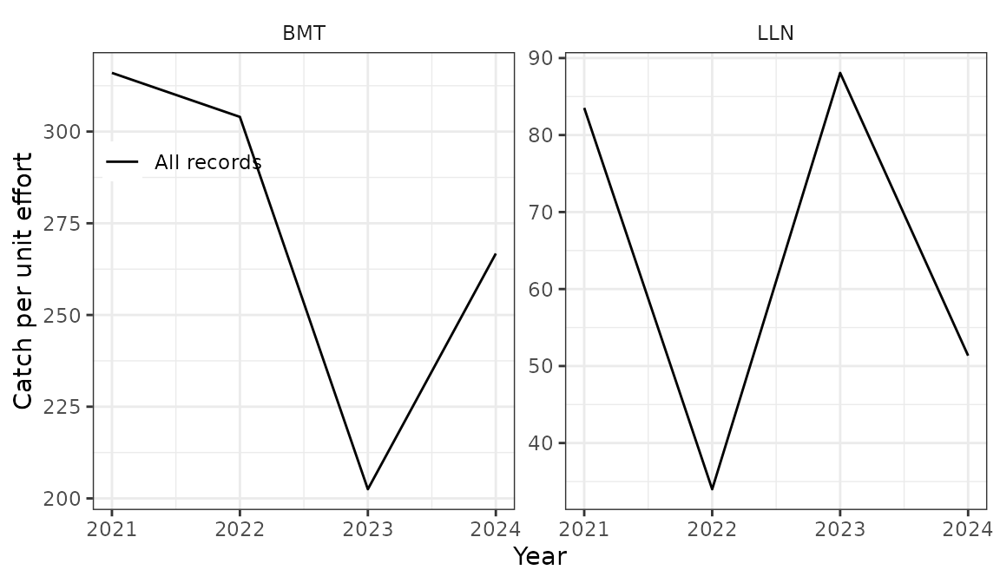

# Landings and logbooks: gears and depth classes

The `landings` table of a pax database is the landings register by year,
month, gear, country and ICES area; the `logbook` table the compiled
logbooks by tow, with position, depth and effort. This vignette covers
the two things that most often go wrong with them: gears and depths. All
data here are simulated.

``` r

library(pax)
library(dplyr, warn.conflicts = FALSE)

pcon <- pax_connect()
```

## Gear codes

Both tables have the gear as an MFDB gear code (`mfdb_gear_code`: BMT
bottom trawl, LLN longline, DSE Danish seine, GIL gillnet, …), mapped
from the MFRI gear code (`gear_id`, *veiðarfæri*) with
`biota.gear_mapping`. The mapping is in the package as `gear_mapping`:

``` r

data("gear_mapping", package = "pax")
gear_mapping |> filter(gear_id %in% c(1, 2, 6, 9, 91, 92))
#>    gear_id mfdb_gear_code             source mfdb_gear_code_weight
#> 1        1            LLN biota.gear_mapping                   LLN
#> 2        2            GIL biota.gear_mapping                   GIL
#> 6        6            BMT biota.gear_mapping                   BMT
#> 9        9            NPT biota.gear_mapping                   NPT
#> 57      91            GIL                pax                   GIL
#> 58      92            GIL biota.gear_mapping                   GIL
```

`biota.gear_mapping` has no MFDB code for gear 91 (monkfish gillnet), so
those rows have `mfdb_gear_code` NA in `pax_db`; tidypax mapped it to
GIL. Monkfish lost most of its commercial samples in 2004–2015 and about
14 kt of landings moved to “other” (14-mon). `gear_mapping` adds gear 91
as GIL (`source == "pax"`), and
[`pax_fill_mfdb_gear_code()`](https://hafro.github.io/pax/reference/pax_fill_mfdb_gear_code.md)
fills the missing codes from it:

``` r

landings <- expand.grid(
  year = 2021:2024,
  month = 1:12,
  gear_id = c(6, 1, 91, 9)
)
landings$species <- 1
landings$ices_area <- "5a"
landings$country <- "Iceland"
landings$boat_id <- landings$gear_id * 100 + landings$month %% 3
gm <- gear_mapping[gear_mapping$source == "biota.gear_mapping", ]
landings$mfdb_gear_code <- as.character(gm$mfdb_gear_code)[
  match(landings$gear_id, gm$gear_id)
]
landings$catch <- c(`6` = 3e5, `1` = 2e5, `91` = 5e4, `9` = 1e4)[
  as.character(landings$gear_id)
]
pax_import(pcon, landings)

tbl(pcon, "landings") |>
  count(gear_id, mfdb_gear_code) |>
  collect()
#> # A tibble: 4 × 3
#>   gear_id mfdb_gear_code     n
#>     <dbl> <chr>          <dbl>
#> 1       1 LLN               48
#> 2       9 NPT               48
#> 3      91 NA                48
#> 4       6 BMT               48

tbl(pcon, "landings") |>
  pax_fill_mfdb_gear_code() |>
  count(gear_id, mfdb_gear_code) |>
  collect()
#> # A tibble: 4 × 3
#>   gear_id mfdb_gear_code     n
#>     <dbl> <chr>          <dbl>
#> 1       1 LLN               48
#> 2       6 BMT               48
#> 3      91 GIL               48
#> 4       9 NPT               48
```

Only missing codes are filled. 13-cas does this on its stations before
the length distributions; do it on the landings too before grouping by
gear.

## Landings by gear group

[`pax_landings_by_gear()`](https://hafro.github.io/pax/reference/pax_landings.md)
groups gears with a `gear_group` list. The names are the groups, the
values the MFDB codes in them;
[`pax_add_other()`](https://hafro.github.io/pax/reference/pax_add_groupings.md)
marks the default group for every gear not listed, and an `NA` in a
group takes the rows with no gear:

``` r

gear_group <- list(
  BMT = c("BMT", "NPT", "SHT", "PGT"),
  LLN = "LLN",
  GIL = "GIL",
  Other = pax_add_other()
)
by_gear <- tbl(pcon, "landings") |>
  pax_fill_mfdb_gear_code() |>
  pax_landings_by_gear(gear_group = gear_group)

by_gear |>
  group_by(year, gear_name) |>
  summarise(catch_t = sum(catch, na.rm = TRUE) / 1e3, .groups = "drop") |>
  collect() |>
  tidyr::pivot_wider(names_from = gear_name, values_from = catch_t) |>
  arrange(year)
#> # A tibble: 4 × 4
#>    year   GIL   BMT   LLN
#>   <int> <dbl> <dbl> <dbl>
#> 1  2021   600  3720  2400
#> 2  2022   600  3720  2400
#> 3  2023   600  3720  2400
#> 4  2024   600  3720  2400
```

`catch` is in kg. Without the default group, landings with other gears
get no group: in
[`pax_si_scale_by_landings()`](https://hafro.github.io/pax/reference/pax_si.md)
they are left out of the raising, with a message. The same `gear_group`
lists drive the age–length keys and the advice and tech report figures
(`hafroreports::hr_advice_plot_landings()`,
`hr_techreport_plot_landings_gear()`), so use the stock’s own groups
there.

The landings by fishing year (September to August, from 1991). Two
caveats in this version of pax: `catch_kt` is `sum(catch) / 1000`, so it
is in tonnes when `catch` is in kg, as in the `landings` table; and the
function needs dplyr attached
([`library(dplyr)`](https://dplyr.tidyverse.org)), as it calls
[`sql()`](https://dplyr.tidyverse.org/reference/sql.html) without
`dplyr::`.

``` r

tbl(pcon, "landings") |>
  pax_landings_fishingyear_summary(ignore_final_year = FALSE) |>
  collect()
#> # A tibble: 5 × 2
#>   fishing_year catch_kt
#>   <chr>           <dbl>
#> 1 2020/2021        4480
#> 2 2021/2022        6720
#> 3 2022/2023        6720
#> 4 2023/2024        6720
#> 5 2024/2025        2240
```

## Depth classes of logbook records

[`pax_add_ocean_depth_class()`](https://hafro.github.io/pax/reference/pax_add_groupings.md)
puts each record in a depth class from its `ocean_depth` column. Records
with no recorded depth get the mean depth of the bathymetry around their
own position: their h3 cells are matched to the `ocean_depth` table at
`fill_resolution` (default 6, cells of about 36 km²), and at two coarser
resolutions where that finds nothing. Records without a position stay
“Unknown”. The bathymetry comes from
[`pax_marmap_ocean_depth()`](https://hafro.github.io/pax/reference/pax_marmap_ocean_depth.md)
(a cached NOAA grid around Iceland, imported by
[`pax_from_mar()`](https://hafro.github.io/pax/reference/pax_from_mar.md)).

``` r

pax_import(pcon, pax_marmap_ocean_depth())
#> This is removed when the R session ends.
#> • Extensions are re-downloaded each session.
#> • Secrets are lost.

# Tows at the centres of random gridcells (statistical subrectangles)
data("gridcell", package = "pax")
set.seed(3)
cells <- gridcell[sample(nrow(gridcell), 100, replace = TRUE), ]
logbook <- data.frame(
  year = rep(2021:2024, each = 25),
  month = sample(1:12, 100, replace = TRUE),
  species = 1,
  mfdb_gear_code = sample(c("BMT", "LLN"), 100, replace = TRUE),
  gridcell = cells$gridcell,
  lat = cells$lat,
  lon = cells$lon
)
logbook$ocean_depth <- round(runif(100, 40, 500))
logbook$ocean_depth[1:20] <- NA          # no depth recorded
logbook$lat[1:3] <- logbook$lon[1:3] <- NA  # and no position either
logbook$catch <- round(rlnorm(100, 7, 1))
logbook$tow_time <- ifelse(logbook$mfdb_gear_code == "BMT", 240, NA)
logbook$tow_hooks <- ifelse(logbook$mfdb_gear_code == "LLN", 20000, NA)
logbook$tow_num_nets <- NA_real_
logbook$catch_total <- logbook$catch * 2
pax_import(pcon, logbook)

tbl(pcon, "logbook") |>
  mutate(depth = ifelse(is.na(ocean_depth), "filled", "recorded")) |>
  pax_add_ocean_depth_class(breaks = c(0, 100, 200, 300)) |>
  count(depth, ocean_depth_class) |>
  collect() |>
  arrange(ocean_depth_class) |>
  tidyr::pivot_wider(names_from = depth, values_from = n, values_fill = 0)
#> # A tibble: 5 × 3
#>   ocean_depth_class filled recorded
#>   <chr>              <dbl>    <dbl>
#> 1 0-100                  2        9
#> 2 100-200                1       16
#> 3 200-300                0       17
#> 4 300+                  14       38
#> 5 Unknown                3        0
```

`breaks` are the class bounds; depths beyond the last bound form a plus
group (“300+”). `hafroreports::hr_techreport_plot_catchdepth()` uses
this for the catch by depth figure.

**Pitfall:** before pax branch `smn-survey` (commit a56fe05), every
missing depth got one and the same value (the mean of the whole
bathymetry table, about 950 m), so all records without a depth landed in
the deepest class. 07-bli and 60-norway-redfish work around it with
their own depth classes (`bli_depth_class()`, `sfv_depth_class()`), from
the mean depth of the gridcell. With a current pax the workaround is not
needed, but the numbers differ a little (cells around the position
instead of the gridcell). Check the share of catch in “Unknown” and in
the classes of filled records.

## CPUE

[`pax_add_cpue()`](https://hafro.github.io/pax/reference/pax_logbook.md)
takes the effort from the first of tow time (hours), hooks (thousands)
or nets; Danish seine hauls count as one. Records with none of these get
`effort_na` (default 1, i.e. one hour); `NULL` leaves them out.

``` r

tbl(pcon, "logbook") |>
  pax_add_cpue() |>
  pax_logbook_cpue_plot()
```



`hafroreports::hr_techreport_plot_cpue()` draws the same figure from a
`pax_db`.

## AI use

This vignette was drafted with Claude (Anthropic) in October 2026 and
has not yet been checked by a person. (MFRI policy on AI use.)
