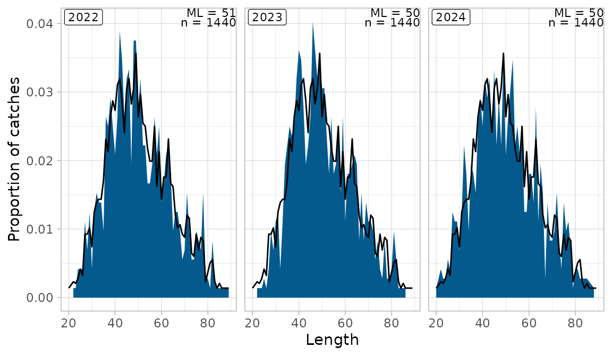

# Length distributions, age-length keys and catch at age

The commercial catch at age of the SAM stocks is the length distribution
of the commercial samples, split into ages with an age–length key, and
raised to the landings by gear and season. In pax that is

    station |> pax_si_by_length() |> pax_si_scale_by_alk() |> pax_si_scale_by_landings()

with the key from
[`pax_ldist_alk()`](https://hafro.github.io/pax/reference/pax_ldist.md).
The stock repos call it through
`hafroreports::hr_input_data_si_index(scale_by_landings = TRUE)`, which
adds weights, maturity and the stock-specific fixes; this vignette shows
the pax steps underneath, on simulated data.

## Toy commercial samples

``` r

library(pax)
library(dplyr, warn.conflicts = FALSE)

pcon <- pax_connect()
set.seed(1)

# 36 samples: 3 years, 2 gears, 2 half-years, 3 gridcells
station <- expand.grid(
  year = 2022:2024,
  mfdb_gear_code = c("BMT", "LLN"),
  month = c(3, 9),
  gridcell = c(3213, 3703, 6113),
  stringsAsFactors = FALSE
)
station$sample_id <- seq_len(nrow(station))
station$sampling_type <- 1             # commercial, collected by inspectors
station$gear_id <- ifelse(station$mfdb_gear_code == "BMT", 6, 1)
station$station <- station$sample_id
station$tow_number <- sample(1:60, nrow(station), replace = TRUE)  # haul number
station$tow_length <- NA_real_
station$tow_depth <- NA_real_
# One sample has no position (no gridcell)
station$gridcell[station$sample_id == 1] <- NA
pax_import(pcon, station)

# Ages and lengths of the fish in each sample. The ldist table holds the
# length counts raised to the counted fish (here x 2); aldist the otoliths
fish <- do.call(rbind, lapply(station$sample_id, function(i) {
  age <- sample(2:9, 60, replace = TRUE, prob = c(1, 3, 4, 4, 3, 2, 1, 1))
  len <- round(15 + 7 * age + rnorm(60, 0, 4))
  data.frame(sample_id = i, species = 1, age = age, length = len)
}))
ldist <- fish |>
  count(sample_id, species, length, name = "count") |>
  mutate(sex = NA_real_, count = 2 * count)
aldist <- fish |>
  group_by(sample_id) |>
  slice_head(n = 20) |>                 # 20 otoliths per sample
  ungroup() |>
  mutate(weight = 0.01 * length^3, count = 1)
measurement <- data.frame(
  sample_id = rep(station$sample_id, 2),
  species = 1,
  measurement_type = rep(c("LEN", "CNT"), each = nrow(station)),
  count = 60
)
pax_import(pcon, ldist)
pax_import(pcon, aldist)
pax_import(pcon, measurement)
pax_import(pcon, data.frame(species = 1, a = 0.01, b = 3), name = "lw_coeffs")

# Landings (kg) by year, month and gear; some with no month
landings <- expand.grid(year = 2022:2024, month = c(1:12, NA), gear_id = c(6, 1))
landings$species <- 1
landings$mfdb_gear_code <- ifelse(landings$gear_id == 6, "BMT", "LLN")
landings$catch <- ifelse(is.na(landings$month), 50e3, 400e3)
landings$ices_area <- "5a"
landings$country <- "Iceland"
landings$boat_id <- 1
pax_import(pcon, landings)
```

## Length distributions, raised once

The `ldist` table that
[`pax_from_mar()`](https://hafro.github.io/pax/reference/pax_from_mar.md)
imports is already raised to the counted fish (with
`mar::skala_med_taldir()`): a sample with 60 fish measured and 60 more
counted has every length count doubled.
[`pax_ldist_scale_abund()`](https://hafro.github.io/pax/reference/pax_ldist.md)
does the same raising from the `measurement` table, and is only for
unraised counts. Applied to `ldist` it raises a second time:

``` r

tbl(pcon, "ldist") |>
  pax_ldist_scale_abund() |>
  summarise(fish = sum(count)) |>
  pull(fish)
#> [1] 8640
tbl(pcon, "ldist") |> summarise(fish = sum(count)) |> pull(fish)
#> [1] 4320
```

So round the lengths and nothing else:

``` r

ld <- tbl(pcon, "station") |>
  filter(sampling_type %in% c(1, 2, 8)) |>
  pax_ldist_by_year(ldist_tbl = tbl(pcon, "ldist") |> pax_ldist_scale_round()) |>
  filter(!is.na(length))
ld |> pax_ldist_plot()
```



The default of `ldist_tbl` in this version of pax only rounds; older
versions (before branch `smn-survey`) raised again, as did the
hafroreports survey length figures. The stock repos pass `ldist_tbl`
explicitly (04-whg, 07-bli, 12-rjr, 13-cas, 14-mon, 16-dgs).
[`pax_ldist_by_year()`](https://hafro.github.io/pax/reference/pax_ldist.md)
also returns a row with `length` NA for samples without the species:
drop it before e.g. `max(length)`.
[`pax_ldist_joy_plot()`](https://hafro.github.io/pax/reference/pax_ldist.md)
draws the same data by gear.

## Age–length key

[`pax_ldist_alk()`](https://hafro.github.io/pax/reference/pax_ldist.md)
joins the stations to the otoliths in `aldist` and gives the proportion
at age (`agep`) in each cell of year, gear group, region, half-year and
length group:

``` r

groups <- list(
  lgroups = seq(0, 100, 5),
  gear_group = list(BMT = "BMT", LLN = "LLN"),
  tgroup = list(t1 = 1:6, t2 = 7:12)
)
comm <- tbl(pcon, "station") |> filter(sampling_type %in% c(1, 2, 8))
alk <- comm |>
  pax_ldist_alk(
    lgroups = groups$lgroups,
    gear_group = groups$gear_group,
    tgroup = groups$tgroup
  )
alk |>
  filter(ygroup == 2022, gear_name == "BMT", tgroup == "t1", lgroup == 50) |>
  arrange(age) |>
  collect()
#> # A tibble: 2 × 8
#> # Groups:   ygroup, gear_name, region, species, tgroup, lgroup [1]
#>   ygroup gear_name region species tgroup lgroup   age  agep
#>    <int> <chr>     <chr>    <dbl> <chr>   <int> <int> <dbl>
#> 1   2022 BMT       all          1 t1         50     5 0.714
#> 2   2022 BMT       all          1 t1         50     6 0.286
```

`lgroups` are lower bounds (here 5 cm groups); the default is 0–200 cm
by 5 cm, so check the old code’s call for its groups (09-wol).

## Catch at age

The samples’ length distributions are split into ages by the key, and
the numbers raised so the biomass matches the landings of each year,
gear group and half-year:

``` r

at_age <- comm |>
  pax_si_by_length() |>
  pax_si_scale_by_alk(
    lgroups = groups$lgroups,
    gear_group = groups$gear_group,
    tgroup = groups$tgroup,
    alk_tbl = alk
  ) |>
  pax_si_scale_by_landings(
    species = 1,
    gear_group = groups$gear_group,
    tgroup = groups$tgroup
  )
#> Landings with unknown month (300 t) are left out of the scaling, see month_na
```

``` r

catch_at_age <- at_age |>
  group_by(year, age) |>
  summarise(
    n = sum(si_abund) / 1000,                   # thousands
    mw = 1000 * sum(si_biomass) / sum(si_abund) # g
  ) |>
  collect() |>
  arrange(year, age)
#> ! Grouped output by "year".
#> ℹ Override behaviour and silence this message with the `.groups` argument.
#> ℹ Or use `.by` instead of `group_by()`.
head(catch_at_age)
#> # A tibble: 6 × 4
#> # Groups:   year [1]
#>    year   age     n    mw
#>   <int> <int> <dbl> <dbl>
#> 1  2022     2  293.  285.
#> 2  2022     3 1002.  476.
#> 3  2022     4 1308.  828.
#> 4  2022     5 1474. 1258.
#> 5  2022     6  862. 1963.
#> 6  2022     7  616. 2597.
```

The landings with no month were left out of the raising, with a message.
Old tidypax code gave them month 6 and unknown gear BMT; to do the same,
pass `month_na = 6, gear_na = "BMT"` (in hafroreports
`landings_month_na`, `landings_gear_na`).

The sample without a position was dropped too: it has no gridcell, so no
region, and matches no key cell.

``` r

at_age |> ungroup() |> summarise(samples = n_distinct(sample_id)) |> pull(samples)
#> [1] 35
```

Plaice lost whole years this way (23-ple). Give such samples a gridcell
before the chain (`hr_input_data_si_index(gridcell_na = 2741)`), or
import the stations with `pax_from_mar(gridcell_from_position = TRUE)`.

In the stock repos all of this is one call:

``` r

hafroreports::hr_input_data_si_index(
  pax_db,
  sampling_type = c(1, 2, 8),
  tow_number = NULL,               # haul numbers: no tow filter
  lw_key = input_data_lw_pred,     # weights at length
  maturity_key = input_data_maturity_key,
  tgroup = list(t1 = 1:6, t2 = 7:12),
  gear_group = list(BMT = c("BMT", "NPT", "SHT", "PGT"), LLN = "LLN",
                    DSE = c("PSE", "DSE"), Other = pax::pax_add_other()),
  scale_by_landings = TRUE,
  landings_month_na = 6,
  landings_gear_na = "BMT"
)
```

and `hr_input_data_combine()` (or the stock’s own version) joins catch,
survey indices, weights and maturity into the SAM input.

## Pitfalls

- **Double raising.** Never apply
  [`pax_ldist_scale_abund()`](https://hafro.github.io/pax/reference/pax_ldist.md)
  to the `ldist` table; pass
  `ldist_tbl = tbl(pax_db, "ldist") |> pax_ldist_scale_round()`.
- **No tow filter on commercial samples.** `tow_number` is the haul
  number there (`tow_number = NULL`). With the survey filter `0:35`,
  03-sai lost 8–14% of its samples a year.
- **Unknown gear and month.** Samples and landings were filled
  differently by tidypax; see `sample_gear_na`, `landings_gear_na` and
  `landings_month_na` in `hr_input_data_si_index()`. Gear codes the
  mapping lacks (gear 91) are filled with
  [`pax_fill_mfdb_gear_code()`](https://hafro.github.io/pax/reference/pax_fill_mfdb_gear_code.md)
  (see the landings vignette).
- **Gear groups.** Landings with a gear outside every group are left out
  of the raising (with a message); add a default group with
  `Other = pax_add_other()`.
- **Samples without a position** are dropped at the key (above).
- **More than one region** makes
  [`pax_si_scale_by_landings()`](https://hafro.github.io/pax/reference/pax_si.md)
  split the landings by the logbooks; don’t add a second region just to
  catch unpositioned samples.
- **Stomach-sampling trips.**
  [`pax_from_mar()`](https://hafro.github.io/pax/reference/pax_from_mar.md)
  leaves out the MAG\*/MO\* trips (`skip_trips`) that tidypax kept; cod
  lost up to 26% of its samples. Add them back with
  `extra_tables = "station_skipped"` (01-cod).
- **Pooled years.** Pool years with few otoliths with `ygroup` (or
  `hr_pool_years()`), and scale strata on the real years.
- **Plus group.** Keep all ages in the input data and let SAM form the
  plus group; cutting it early pushes the old fish’s weight onto younger
  ages when raising to landings.

## AI use

This vignette was drafted with Claude (Anthropic) in October 2026 and
has not yet been checked by a person. (MFRI policy on AI use.)
